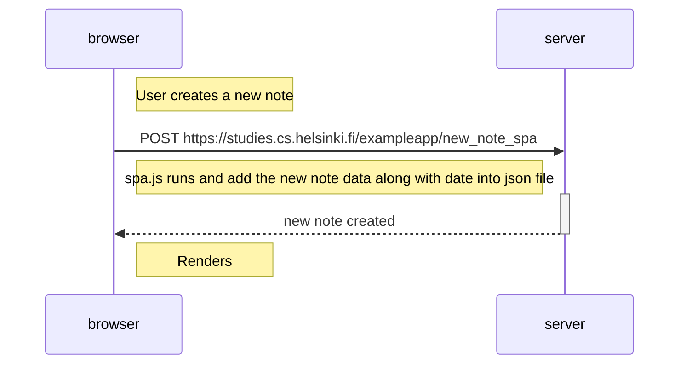

```mermaid
sequenceDiagram
    participant browser
    participant server

    Note right of browser: User creates a new note

    browser->>server: POST https://studies.cs.helsinki.fi/exampleapp/new_note_spa

    Note left of server: spa.js runs and add the new note data along with date into json file
    activate server
    server-->>browser: new note created
    deactivate server

  

    Note right of browser: Renders

   
```